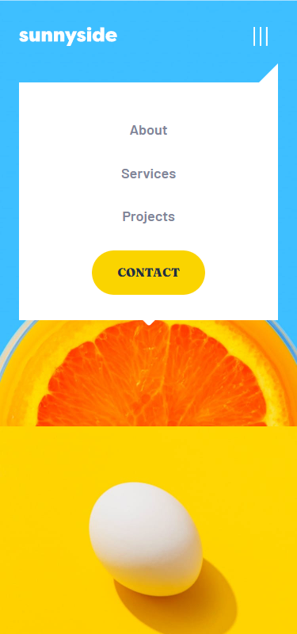

# Frontend Mentor - Sunnyside agency landing page

This is a solution to the [Sunnyside agency landing page](https://www.frontendmentor.io/challenges/sunnyside-agency-landing-page-7yVs3B6ef). Frontend Mentor challenges help you improve your coding skills by building realistic projects.

## Table of contents

- [Overview](#overview)
  - [The challenge](#the-challenge)
  - [Screenshot](#screenshot)
  - [Links](#links)
- [My process](#my-process)
  - [Built with](#built-with)
  - [What I learned](#what-i-learned)
  - [Continued development](#continued-development)
  - [Useful resources](#useful-resources)
- [Author](#author)
- [Updates](#updates)

## Overview

### The challenge

Users should be able to:

- View the optimal layout for the site depending on their device's screen size
- See hover states for all interactive elements on the page

### Screenshot

Mobile version



### Links

- Solution URL: [https://www.frontendmentor.io/solutions/full-responsive-and-somewhat-accessible-landing-page-RktWdPVjWR](https://www.frontendmentor.io/solutions/full-responsive-and-somewhat-accessible-landing-page-RktWdPVjWR)
- Live Site URL: [https://frontend-mentor-challenge11.netlify.app/](https://frontend-mentor-challenge11.netlify.app/)

## My process

### Built with

- IcoMoon icons
- CSS custom properties
- Flexbox
- CSS Grid
- CSS min/clamp functions
- Assemble.io
- Picture with art direction

### What I learned

Like always most of the time was spent fine tuning the solution to better match the design. Figma files would definitely be helpful but to some extent. I'm struggling to setup project from the start either by using CSS custom properties or anything else and it is very costly in the project down the road. One thing to keep in mind is to setup as much as i can beforehand like colors, font sizes etc and style them accordingly when the time comes. This project would be interesting to work with Tailwind CSS. I suppose some things will be much easier.

Skip to content link inspired by WebDevSimplified

```html
<a class="skip-link" href="#main-content">Skip to main content</a>
```

This snippet helped me with css logical properties padding-inline-start and padding-inline-end

```css
.dual[data-state='reversed'] {
  direction: rtl;
}
```

Fixed strange behaviour on some resolutions

```css

```

Style hover for devices that support it

```css
@media (hover: hover) {
  &:hover { …
```

### Continued development

Like in the previous chapter things that can be improved are:

- setup project from the start as much as i can regarding spacing, font sizes, colors etc.
- toggle button for mobile navigation,
- aria roles for footer social icons etc..

### Useful resources

- [hover: hover](https://developer.mozilla.org/en-US/docs/Web/CSS/@media/hover) - MDN docs for hover:hover media query
- [skip link](https://www.youtube.com/watch?v=VUR0I5mqq7I) - Video explaining skip to content links
- [responsive images with art direction](https://dev.opera.com/articles/responsive-images/) - linked from Jake Archibald article

## Author

- Frontend Mentor - [@miranlegin](https://www.frontendmentor.io/profile/miranlegin)

## Updates:

**V1.1**

Thanks to the comment made by Sahand on Frontend Mentor [here](https://www.frontendmentor.io/solutions/full-responsive-and-somewhat-accessible-landing-page-RktWdPVjWR#comment-632a50fa037479dfd70bc8c8) i've made some changes with picture display around breakpoint value that i had before

```css
.dual img {
  width: 100%;
  height: 100%;
  object-fit: cover;
}
```

and also fixed some of the baked in values for font sizes and made them mode fluid with

```css
font-size: clamp(2rem, 3.3vw, 2.5rem);
```

Also i've fixed padding around `dual-content` div with this

```css
.dual-content {
  flex-basis: 50%;
  padding: Max(3rem, 10vw);
}
```
